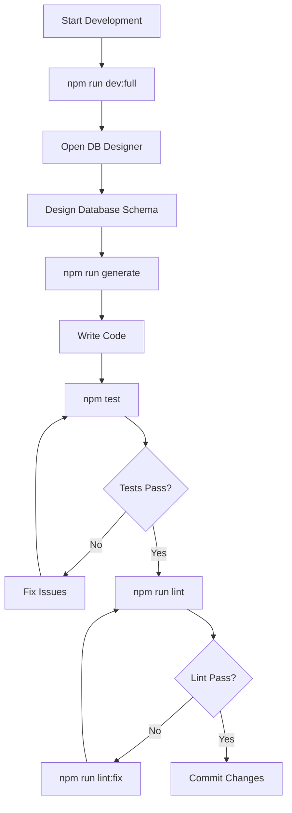
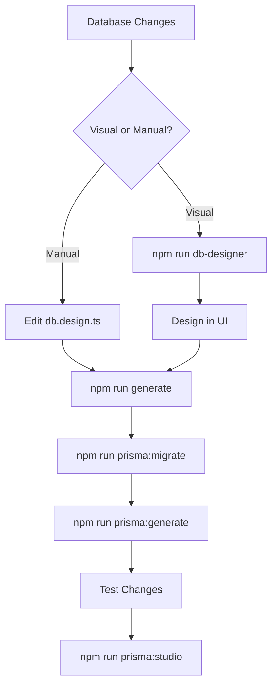
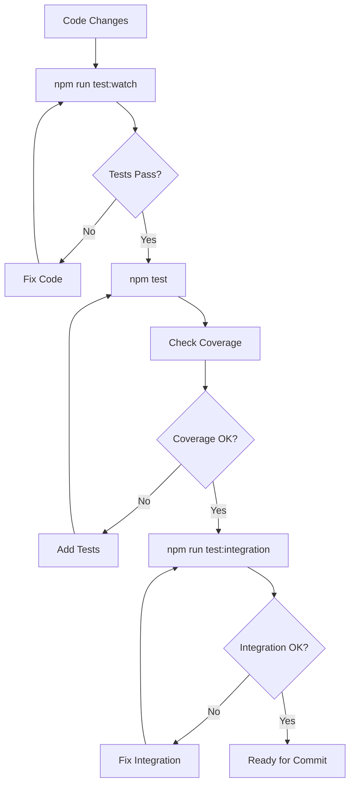
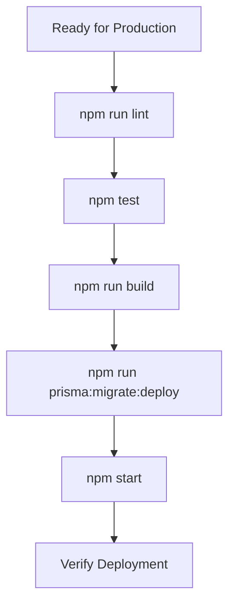

# NPM Scripts & Development Workflows

Complete guide to all NPM scripts available in Mifty projects and their usage in development workflows.

## Core Development Scripts

### Development Server

```bash
npm run dev
```
Start development server with hot reload

```bash
npm run dev:full
```
Start all development services: API + DB Designer + Monitor + Prisma Studio

```bash
npm run dev:server
```
Start only the API server with hot reload

```bash
npm run dev:monitor
```
Start error monitor with auto-fix capabilities

```bash
npm run dev:db-designer
```
Start database designer UI on port 3001

### Build Scripts

```bash
npm run build
```
Build TypeScript to JavaScript and copy UI assets

```bash
npm run build:watch
```
Build in watch mode - rebuilds on file changes

```bash
npm start
```
Start production server (requires build first)

## Database Management Scripts

### Prisma Commands

```bash
npm run prisma:generate
```
Generate Prisma Client from schema

```bash
npm run prisma:migrate
```
Create and apply database migration

```bash
npm run prisma:migrate:status
```
Check migration status

```bash
npm run prisma:migrate:deploy
```
Deploy migrations in production

```bash
npm run prisma:studio
```
Open Prisma Studio database browser

```bash
npm run prisma:push
```
Push schema changes without creating migration

```bash
npm run prisma:reset
```
⚠️ Reset database and apply all migrations (DELETES DATA)

```bash
npm run prisma:seed
```
Run database seeding script

### Database Designer

```bash
npm run db-designer
```
Start visual database designer UI

```bash
npm run db-designer:build
```
Build project and start database designer

## Code Generation Scripts

### Module Generation

```bash
npm run generate
```
Generate all modules from db.design.ts

```bash
npm run generate:module
```
Generate specific module

```bash
npm run generate:ai
```
Generate modules using AI assistance

## Testing Scripts

### Test Execution

```bash
npm test
```
Run all tests with coverage report

```bash
npm run test:watch
```
Run tests in watch mode

```bash
npm run test:integration
```
Run integration tests only

## Code Quality Scripts

### Linting

```bash
npm run lint
```
Run ESLint to check code quality

```bash
npm run lint:fix
```
Run ESLint with automatic fixes

### Formatting

```bash
npm run format
```
Format code with Prettier

## Monitoring Scripts

### Error Monitoring

```bash
npm run monitor
```
Start error monitoring system

```bash
npm run monitor:imports
```
Monitor import issues

```bash
npm run monitor:errors
```
Monitor runtime errors

```bash
npm run monitor:autofix
```
Monitor with automatic error fixing

### Import Watching

```bash
npm run watch:imports
```
Watch and report import issues

```bash
npm run watch:imports:autofix
```
Watch imports with automatic fixing

## Adapter Management Scripts

### Adapter Commands

```bash
npm run adapter
```
Run adapter management CLI

```bash
npm run adapter:list
```
List all available adapters

```bash
npm run adapter:installed
```
Show installed adapters

### Authentication Adapters

```bash
npm run auth:list
```
List authentication adapters

```bash
npm run auth:install
```
Install authentication adapter

## Configuration Scripts

### Service Configuration

```bash
npm run services:config
```
View current services configuration

```bash
npm run configure:server
```
Configure server settings

## Build System Scripts

### Advanced Build

```bash
npm run bundle
```
Bundle all CLI executables

```bash
npm run secure-build
```
Build with security features (obfuscation, byte-compilation)

```bash
npm run obfuscate
```
Obfuscate JavaScript code

```bash
npm run byte-compile
```
Compile JavaScript to bytecode

### Packaging

```bash
npm run pkg:all
```
Create platform-specific executables

```bash
npm run pack
```
Create NPM package

## Development Workflows

### Daily Development Workflow

This is the most common workflow for daily development:



#### Step-by-Step Daily Workflow

1. **Start Development Environment**
   ```bash
npm run dev:full
```
Starts API server, DB designer, monitor, and Prisma Studio

2. **Design Database** (if needed)
   - Open http://localhost:3001/ui in browser
   - Design your database schema visually
   - Save changes

3. **Generate Code**
   ```bash
npm run generate
```
Generate modules from updated database design

4. **Write and Test Code**
   ```bash
npm run test:watch
```
Run tests in watch mode while developing

5. **Quality Check**
   ```bash
npm run lint && npm run format
```
Check code quality and format

### Database Development Workflow

For database-focused development:



#### Database Workflow Steps

1. **Choose Design Method**
   - Visual: `npm run db-designer`
   - Manual: Edit `src/db.design.ts`

2. **Generate Modules**
   ```bash
npm run generate
```
Generate TypeScript modules from schema

3. **Create Migration**
   ```bash
npm run prisma:migrate
```
Create and apply database migration

4. **Update Prisma Client**
   ```bash
npm run prisma:generate
```
Regenerate Prisma Client with new schema

5. **Verify Changes**
   ```bash
npm run prisma:studio
```
Open Prisma Studio to verify database structure

### Testing Workflow

Comprehensive testing approach:



#### Testing Steps

1. **Development Testing**
   ```bash
npm run test:watch
```
Run tests continuously during development

2. **Full Test Suite**
   ```bash
npm test
```
Run all tests with coverage report

3. **Integration Testing**
   ```bash
npm run test:integration
```
Run integration tests

### Production Deployment Workflow

For production deployment:



#### Production Steps

1. **Quality Assurance**
   ```bash
npm run lint && npm test
```
Ensure code quality and all tests pass

2. **Build for Production**
   ```bash
npm run build
```
Build optimized production bundle

3. **Database Migration**
   ```bash
npm run prisma:migrate:deploy
```
Apply migrations in production

4. **Start Production Server**
   ```bash
npm start
```
Start production server

## Troubleshooting Common Script Issues

### Build Issues

**Problem**: Build fails with TypeScript errors
```bash
npm run lint:fix && npm run build
```
Fix linting issues and rebuild

**Problem**: Missing UI assets after build
```bash
npm run copy-ui && npm run build
```
Ensure UI assets are copied during build

### Database Issues

**Problem**: Prisma Client out of sync
```bash
npm run prisma:generate
```
Regenerate Prisma Client

**Problem**: Migration conflicts
```bash
npm run prisma:migrate:status
```
Check migration status and resolve conflicts

### Development Server Issues

**Problem**: Port already in use
```bash
npm run services:config
```
Check current port configuration

**Problem**: Hot reload not working
```bash
npm run dev:server
```
Restart development server

### Testing Issues

**Problem**: Tests failing after database changes
```bash
npm run prisma:generate && npm test
```
Regenerate Prisma Client and run tests

**Problem**: Coverage too low
```bash
npm run test:coverage
```
Generate detailed coverage report

## Script Categories by Use Case

### Daily Development
- `npm run dev:full`
- `npm run test:watch`
- `npm run generate`
- `npm run lint:fix`

### Database Work
- `npm run db-designer`
- `npm run prisma:migrate`
- `npm run prisma:studio`
- `npm run prisma:generate`

### Quality Assurance
- `npm test`
- `npm run lint`
- `npm run format`
- `npm run test:integration`

### Production
- `npm run build`
- `npm start`
- `npm run prisma:migrate:deploy`

### Debugging
- `npm run monitor`
- `npm run watch:imports`
- `npm run services:config`

## Performance Tips

### Faster Development
- Use `npm run dev:server` instead of `npm run dev:full` if you don't need all services
- Use `npm run test:watch` for continuous testing
- Use `npm run build:watch` for continuous building

### Efficient Database Work
- Use `npm run prisma:push` for quick schema testing (no migration)
- Use `npm run db-designer` for visual schema design
- Use `npm run prisma:studio` for data inspection

### Better Testing
- Use `npm run test:watch` during development
- Run `npm test` before commits
- Use `npm run test:integration` for full system testing