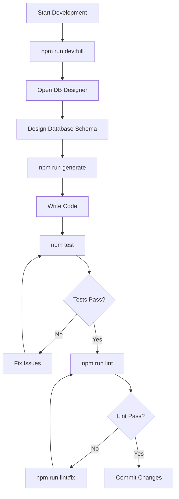
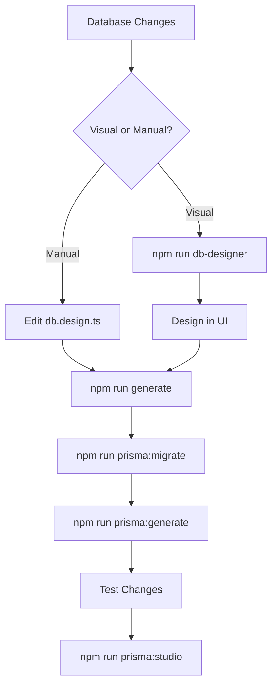
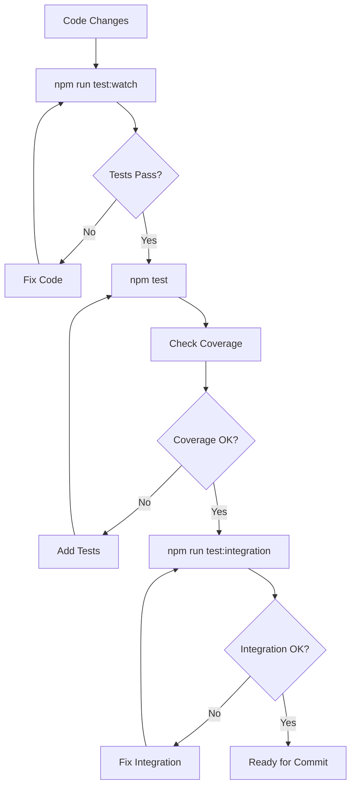
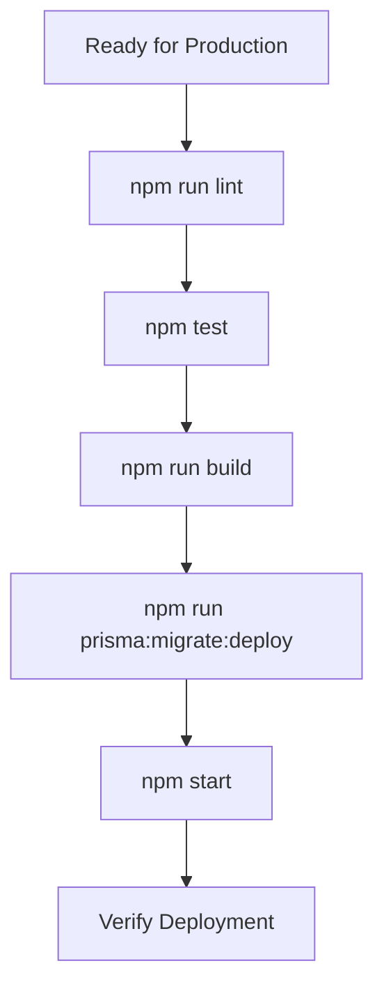

# NPM Scripts & Development Workflows

Complete guide to all NPM scripts available in Mifty projects and their usage in development workflows.

import CommandBlock from '@site/src/components/CommandBlock';

## Core Development Scripts

### Development Server

<CommandBlock 
  command="npm run dev"
  description="Start development server with hot reload"
/>

<CommandBlock 
  command="npm run dev:full"
  description="Start all development services: API + DB Designer + Monitor + Prisma Studio"
/>

<CommandBlock 
  command="npm run dev:server"
  description="Start only the API server with hot reload"
/>

<CommandBlock 
  command="npm run dev:monitor"
  description="Start error monitor with auto-fix capabilities"
/>

<CommandBlock 
  command="npm run dev:db-designer"
  description="Start database designer UI on port 3001"
/>

### Build Scripts

<CommandBlock 
  command="npm run build"
  description="Build TypeScript to JavaScript and copy UI assets"
/>

<CommandBlock 
  command="npm run build:watch"
  description="Build in watch mode - rebuilds on file changes"
/>

<CommandBlock 
  command="npm start"
  description="Start production server (requires build first)"
/>

## Database Management Scripts

### Prisma Commands

<CommandBlock 
  command="npm run prisma:generate"
  description="Generate Prisma Client from schema"
/>

<CommandBlock 
  command="npm run prisma:migrate"
  description="Create and apply database migration"
/>

<CommandBlock 
  command="npm run prisma:migrate:status"
  description="Check migration status"
/>

<CommandBlock 
  command="npm run prisma:migrate:deploy"
  description="Deploy migrations in production"
/>

<CommandBlock 
  command="npm run prisma:studio"
  description="Open Prisma Studio database browser"
/>

<CommandBlock 
  command="npm run prisma:push"
  description="Push schema changes without creating migration"
/>

<CommandBlock 
  command="npm run prisma:reset"
  description="⚠️ Reset database and apply all migrations (DELETES DATA)"
/>

<CommandBlock 
  command="npm run prisma:seed"
  description="Run database seeding script"
/>

### Database Designer

<CommandBlock 
  command="npm run db-designer"
  description="Start visual database designer UI"
/>

<CommandBlock 
  command="npm run db-designer:build"
  description="Build project and start database designer"
/>

## Code Generation Scripts

### Module Generation

<CommandBlock 
  command="npm run generate"
  description="Generate all modules from db.design.ts"
/>

<CommandBlock 
  command="npm run generate:module"
  description="Generate specific module"
/>

<CommandBlock 
  command="npm run generate:ai"
  description="Generate modules using AI assistance"
/>

## Testing Scripts

### Test Execution

<CommandBlock 
  command="npm test"
  description="Run all tests with coverage report"
/>

<CommandBlock 
  command="npm run test:watch"
  description="Run tests in watch mode"
/>

<CommandBlock 
  command="npm run test:integration"
  description="Run integration tests only"
/>

## Code Quality Scripts

### Linting

<CommandBlock 
  command="npm run lint"
  description="Run ESLint to check code quality"
/>

<CommandBlock 
  command="npm run lint:fix"
  description="Run ESLint with automatic fixes"
/>

### Formatting

<CommandBlock 
  command="npm run format"
  description="Format code with Prettier"
/>

## Monitoring Scripts

### Error Monitoring

<CommandBlock 
  command="npm run monitor"
  description="Start error monitoring system"
/>

<CommandBlock 
  command="npm run monitor:imports"
  description="Monitor import issues"
/>

<CommandBlock 
  command="npm run monitor:errors"
  description="Monitor runtime errors"
/>

<CommandBlock 
  command="npm run monitor:autofix"
  description="Monitor with automatic error fixing"
/>

### Import Watching

<CommandBlock 
  command="npm run watch:imports"
  description="Watch and report import issues"
/>

<CommandBlock 
  command="npm run watch:imports:autofix"
  description="Watch imports with automatic fixing"
/>

## Adapter Management Scripts

### Adapter Commands

<CommandBlock 
  command="npm run adapter"
  description="Run adapter management CLI"
/>

<CommandBlock 
  command="npm run adapter:list"
  description="List all available adapters"
/>

<CommandBlock 
  command="npm run adapter:installed"
  description="Show installed adapters"
/>

### Authentication Adapters

<CommandBlock 
  command="npm run auth:list"
  description="List authentication adapters"
/>

<CommandBlock 
  command="npm run auth:install"
  description="Install authentication adapter"
/>

## Configuration Scripts

### Service Configuration

<CommandBlock 
  command="npm run services:config"
  description="View current services configuration"
/>

<CommandBlock 
  command="npm run configure:server"
  description="Configure server settings"
/>

## Build System Scripts

### Advanced Build

<CommandBlock 
  command="npm run bundle"
  description="Bundle all CLI executables"
/>

<CommandBlock 
  command="npm run secure-build"
  description="Build with security features (obfuscation, byte-compilation)"
/>

<CommandBlock 
  command="npm run obfuscate"
  description="Obfuscate JavaScript code"
/>

<CommandBlock 
  command="npm run byte-compile"
  description="Compile JavaScript to bytecode"
/>

### Packaging

<CommandBlock 
  command="npm run pkg:all"
  description="Create platform-specific executables"
/>

<CommandBlock 
  command="npm run pack"
  description="Create NPM package"
/>

## Development Workflows

### Daily Development Workflow

This is the most common workflow for daily development:

#### Step-by-Step Daily Workflow

1. **Start Development Environment**
   <CommandBlock 
     command="npm run dev:full"
     description="Starts API server, DB designer, monitor, and Prisma Studio"
   />

2. **Design Database** (if needed)
   - Open http://localhost:3001/ui in browser
   - Design your database schema visually
   - Save changes

3. **Generate Code**
   <CommandBlock 
     command="npm run generate"
     description="Generate modules from updated database design"
   />

4. **Write and Test Code**
   <CommandBlock 
     command="npm run test:watch"
     description="Run tests in watch mode while developing"
   />

5. **Quality Check**
   <CommandBlock 
     command="npm run lint && npm run format"
     description="Check code quality and format"
   />

### Database Development Workflow

For database-focused development:

#### Database Workflow Steps

1. **Choose Design Method**
   - Visual: `npm run db-designer`
   - Manual: Edit `src/db.design.ts`

2. **Generate Modules**
   <CommandBlock 
     command="npm run generate"
     description="Generate TypeScript modules from schema"
   />

3. **Create Migration**
   <CommandBlock 
     command="npm run prisma:migrate"
     description="Create and apply database migration"
   />

4. **Update Prisma Client**
   <CommandBlock 
     command="npm run prisma:generate"
     description="Regenerate Prisma Client with new schema"
   />

5. **Verify Changes**
   <CommandBlock 
     command="npm run prisma:studio"
     description="Open Prisma Studio to verify database structure"
   />

### Testing Workflow

Comprehensive testing approach:

#### Testing Steps

1. **Development Testing**
   <CommandBlock 
     command="npm run test:watch"
     description="Run tests continuously during development"
   />

2. **Full Test Suite**
   <CommandBlock 
     command="npm test"
     description="Run all tests with coverage report"
   />

3. **Integration Testing**
   <CommandBlock 
     command="npm run test:integration"
     description="Run integration tests"
   />

### Production Deployment Workflow

For production deployment:

#### Production Steps

1. **Quality Assurance**
   <CommandBlock 
     command="npm run lint && npm test"
     description="Ensure code quality and all tests pass"
   />

2. **Build for Production**
   <CommandBlock 
     command="npm run build"
     description="Build optimized production bundle"
   />

3. **Database Migration**
   <CommandBlock 
     command="npm run prisma:migrate:deploy"
     description="Apply migrations in production"
   />

4. **Start Production Server**
   <CommandBlock 
     command="npm start"
     description="Start production server"
   />

## Troubleshooting Common Script Issues

### Build Issues

**Problem**: Build fails with TypeScript errors
<CommandBlock 
  command="npm run lint:fix && npm run build"
  description="Fix linting issues and rebuild"
/>

**Problem**: Missing UI assets after build
<CommandBlock 
  command="npm run copy-ui && npm run build"
  description="Ensure UI assets are copied during build"
/>

### Database Issues

**Problem**: Prisma Client out of sync
<CommandBlock 
  command="npm run prisma:generate"
  description="Regenerate Prisma Client"
/>

**Problem**: Migration conflicts
<CommandBlock 
  command="npm run prisma:migrate:status"
  description="Check migration status and resolve conflicts"
/>

### Development Server Issues

**Problem**: Port already in use
<CommandBlock 
  command="npm run services:config"
  description="Check current port configuration"
/>

**Problem**: Hot reload not working
<CommandBlock 
  command="npm run dev:server"
  description="Restart development server"
/>

### Testing Issues

**Problem**: Tests failing after database changes
<CommandBlock 
  command="npm run prisma:generate && npm test"
  description="Regenerate Prisma Client and run tests"
/>

**Problem**: Coverage too low
<CommandBlock 
  command="npm run test:coverage"
  description="Generate detailed coverage report"
/>

## Script Categories by Use Case

### Daily Development
- `npm run dev:full`
- `npm run test:watch`
- `npm run generate`
- `npm run lint:fix`

### Database Work
- `npm run db-designer`
- `npm run prisma:migrate`
- `npm run prisma:studio`
- `npm run prisma:generate`

### Quality Assurance
- `npm test`
- `npm run lint`
- `npm run format`
- `npm run test:integration`

### Production
- `npm run build`
- `npm start`
- `npm run prisma:migrate:deploy`

### Debugging
- `npm run monitor`
- `npm run watch:imports`
- `npm run services:config`

## Performance Tips

### Faster Development
- Use `npm run dev:server` instead of `npm run dev:full` if you don't need all services
- Use `npm run test:watch` for continuous testing
- Use `npm run build:watch` for continuous building

### Efficient Database Work
- Use `npm run prisma:push` for quick schema testing (no migration)
- Use `npm run db-designer` for visual schema design
- Use `npm run prisma:studio` for data inspection

### Better Testing
- Use `npm run test:watch` during development
- Run `npm test` before commits
- Use `npm run test:integration` for full system testing