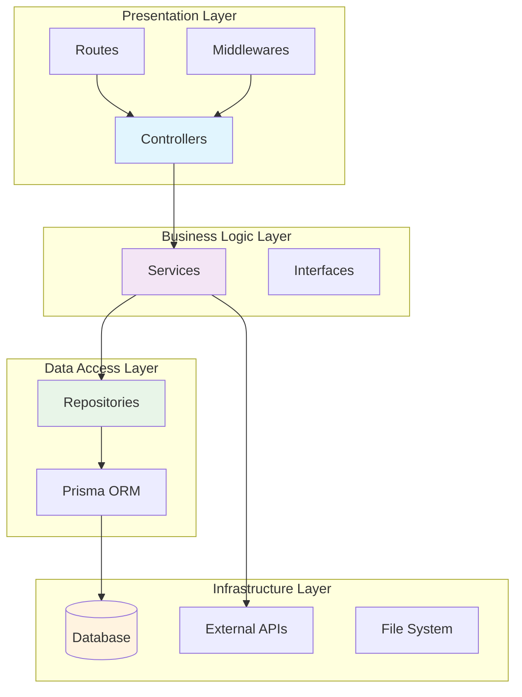
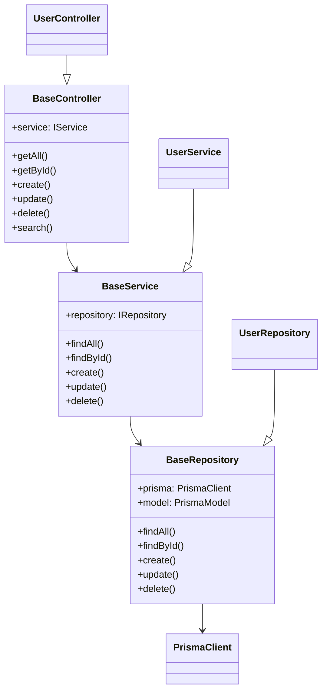
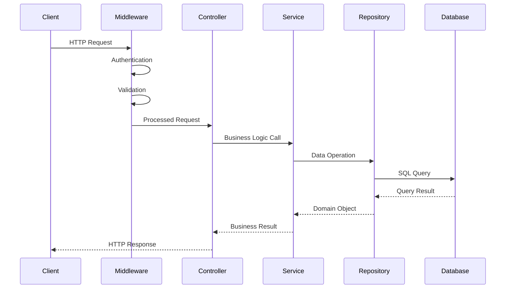
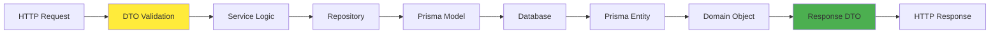
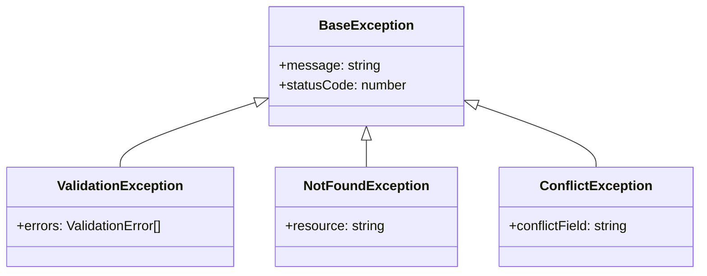

# Architecture Overview

Mifty Framework follows a **Clean Architecture** pattern with **Dependency Injection**, providing a scalable, maintainable, and testable foundation for enterprise Node.js applications.

## Core Architecture Principles

### 🏗️ Clean Architecture Layers

Mifty implements a layered architecture that separates concerns and ensures maintainability:



### 🔄 Dependency Injection

Mifty uses **tsyringe** for dependency injection, enabling:
- **Loose coupling** between components
- **Easy testing** with mock dependencies
- **Flexible configuration** and service swapping
- **Automatic dependency resolution**

```typescript
// Example: Service with injected dependencies
@injectable()
export class UserService extends BaseService<User, CreateUserDto, UpdateUserDto> {
  constructor(
    @inject('UserRepository') userRepository: IUserRepository,
    @inject('EmailService') private emailService: IEmailService
  ) {
    super(userRepository);
  }
}
```

## Component Architecture

### 📋 Base Classes Hierarchy

Mifty provides base classes that implement common patterns:



### 🎯 Interface-Driven Design

All components implement interfaces for maximum flexibility:

```typescript
// Core interfaces ensure consistent contracts
export interface IService<T, TCreateInput, TUpdateInput> {
  findAll(options?: any): Promise<T[]>;
  findById(id: string): Promise<T | null>;
  create(data: TCreateInput): Promise<T>;
  update(id: string, data: TUpdateInput): Promise<T | null>;
  delete(id: string): Promise<boolean>;
  // ... additional methods
}

export interface IRepository<T, TCreateInput, TUpdateInput> {
  findAll(options?: any): Promise<T[]>;
  findById(id: string): Promise<T | null>;
  create(data: TCreateInput): Promise<T>;
  update(id: string, data: TUpdateInput): Promise<T | null>;
  delete(id: string): Promise<boolean>;
  // ... additional methods
}
```

## Application Structure

### 🏢 Modular Architecture

Mifty organizes code into **modules** that encapsulate related functionality:

```
src/
├── core/                    # Framework core components
│   ├── base/               # Base classes (Controller, Service, Repository)
│   ├── interfaces/         # Core interfaces and contracts
│   ├── middlewares/        # Express middlewares
│   ├── exceptions/         # Custom exception classes
│   └── utils/              # Utility functions
├── modules/                # Business modules
│   └── user/              # Example user module
│       ├── controllers/    # HTTP request handlers
│       ├── services/       # Business logic
│       ├── repositories/   # Data access layer
│       ├── dto/           # Data transfer objects
│       ├── routes/        # Route definitions
│       └── di.ts          # Dependency injection setup
├── loaders/               # Application loaders
│   ├── di.ts             # Dependency injection loader
│   ├── express.ts        # Express app configuration
│   ├── routes.ts         # Route loader
│   └── prisma.ts         # Database connection
├── config/               # Configuration files
├── types/                # TypeScript type definitions
└── app.ts               # Main application class
```

### 🔧 Configuration-Driven Services

Services are configured through the `AppConfig` interface:

```typescript
interface AppConfig {
  modules: ModuleConfig[];     // Which modules to load
  server: ServerConfig;        // Server configuration
}

interface ModuleConfig {
  name: string;               // Module name
  enabled: boolean;           // Enable/disable module
  routesPrefix?: string;      // API route prefix
  includeRoutes?: string[];   // Specific routes to include
  excludeRoutes?: string[];   // Specific routes to exclude
}
```

## Request Flow Architecture

### 🌊 Request Processing Pipeline



### 🛡️ Middleware Stack

Mifty includes a comprehensive middleware stack:

1. **Security Middleware** (Helmet)
2. **CORS Middleware**
3. **Compression Middleware**
4. **Request Logging** (Morgan)
5. **Request Context** (Custom)
6. **Error Handling** (Custom)

## Data Flow Architecture

### 📊 Database Integration

Mifty uses **Prisma ORM** for type-safe database operations:

```typescript
// Repository pattern with Prisma
export class UserRepository extends BaseRepository<User, CreateUserDto, UpdateUserDto> {
  constructor(prisma: PrismaClient) {
    super(prisma, 'user'); // 'user' is the Prisma model name
  }
  
  // Custom methods specific to User entity
  async findByEmail(email: string): Promise<User | null> {
    return this.model.findUnique({ where: { email } });
  }
}
```

### 🔄 Data Transformation

Data flows through multiple transformation layers:



## Microservices Architecture

### 🏗️ Service Composition

Mifty supports both **monolithic** and **microservices** architectures:

```typescript
// Multiple service configuration
const config: AppConfig = {
  modules: [
    { name: 'user', enabled: true, routesPrefix: '/api/v1/user' },
    { name: 'product', enabled: true, routesPrefix: '/api/v1/product' },
    { name: 'order', enabled: true, routesPrefix: '/api/v1/order' }
  ],
  server: { port: 3000 }
};
```

### 🔧 Service Discovery

Services are configured through `services.config.ts`:

```typescript
export const SERVICES_CONFIG = {
  dev: [
    {
      name: 'API',
      script: 'ts-node-dev src/servers/user.server.ts',
      port: 3000,
      description: 'Main API Server'
    },
    {
      name: 'Auth-Service',
      script: 'ts-node-dev src/servers/auth.server.ts',
      port: 3001,
      description: 'Authentication Service'
    }
  ]
};
```

## Error Handling Architecture

### 🚨 Exception Hierarchy

Mifty provides a structured exception system:



### 🔧 Error Middleware

Global error handling with structured responses:

```typescript
export const errorHandler = () => {
  return (error: Error, req: Request, res: Response, next: NextFunction) => {
    if (error instanceof ValidationException) {
      return res.status(400).json({
        success: false,
        message: 'Validation failed',
        errors: error.errors
      });
    }
    
    // Handle other exception types...
  };
};
```

## Performance Architecture

### ⚡ Optimization Strategies

1. **Connection Pooling**: Prisma manages database connections
2. **Query Optimization**: Repository pattern enables query tuning
3. **Caching Layer**: Redis integration for session and data caching
4. **Compression**: Gzip compression for HTTP responses
5. **Static Assets**: Efficient static file serving

### 📊 Monitoring Integration

Built-in monitoring and observability:

```typescript
// Request context for tracing
export const requestContextMiddleware = (req: Request, res: Response, next: NextFunction) => {
  const requestId = uuid();
  req.context = { requestId, timestamp: new Date() };
  next();
};
```

## Security Architecture

### 🔒 Security Layers

1. **Helmet**: Security headers
2. **CORS**: Cross-origin resource sharing
3. **Input Validation**: Zod schema validation
4. **Authentication**: Passport.js integration
5. **Authorization**: Role-based access control

### 🛡️ Data Protection

- **SQL Injection Prevention**: Prisma ORM parameterized queries
- **XSS Protection**: Input sanitization and validation
- **CSRF Protection**: Token-based protection
- **Rate Limiting**: Request throttling capabilities

## Best Practices

### 📋 Design Principles

1. **Single Responsibility**: Each class has one reason to change
2. **Dependency Inversion**: Depend on abstractions, not concretions
3. **Interface Segregation**: Small, focused interfaces
4. **Open/Closed**: Open for extension, closed for modification

### 🎯 Development Guidelines

- Use **dependency injection** for all service dependencies
- Implement **interfaces** for all service contracts
- Follow **repository pattern** for data access
- Use **DTOs** for data validation and transformation
- Implement **proper error handling** at all layers
- Write **unit tests** for business logic
- Use **integration tests** for API endpoints

This architecture ensures that Mifty applications are scalable, maintainable, and follow enterprise-grade patterns while remaining developer-friendly and productive.